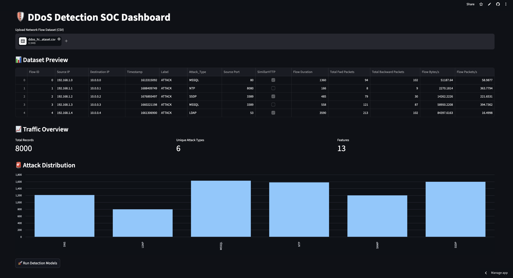
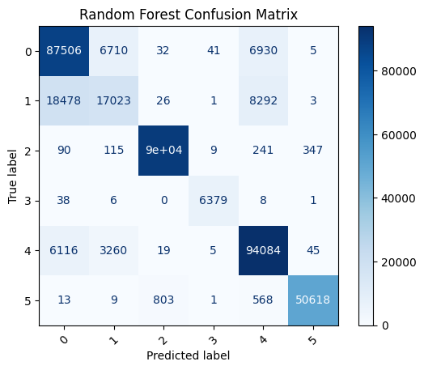
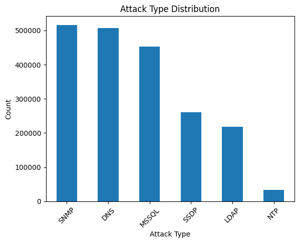
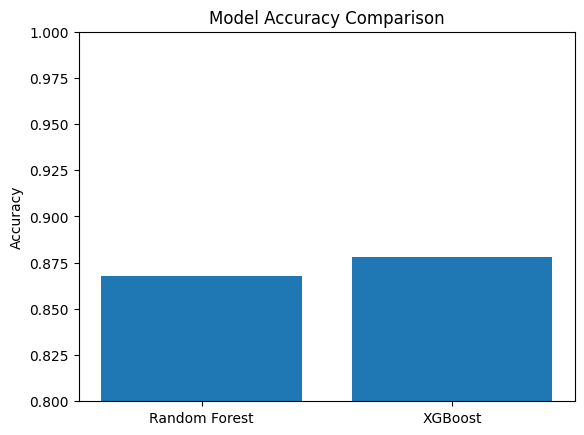

# 🚨 Machine Learning-Based DDoS Detection System

## 📌 Overview

This project presents a Machine Learning-based system for detecting Distributed Denial-of-Service (DDoS) attacks using real-world network traffic data.

The system is built using the **CIC-DDoS2019 dataset (~30GB)** and integrates machine learning models into a **SOC-style (Security Operations Center) dashboard** using Streamlit.

---
## 🖥️ Dashboard Preview



---

## 🚀 Live Demo
🔗 https://ddos-detection-ml-soc-dashboard-eejvrhuhhbtm7pwws8tyn9.streamlit.app/

## 🎯 Objectives

* Detect multiple DDoS attack types using flow-based network features
* Compare performance of machine learning models
* Simulate a real-world SOC environment
* Generate actionable alerts for suspicious traffic

---

## 📊 Dataset

* CIC-DDoS2019 Dataset (~30GB)
* Real-world network traffic flows
* Includes attack types:

  * DNS
  * LDAP
  * MSSQL
  * NTP
  * SNMP
  * SSDP
* Represents real-world challenge of **class imbalance**

---

## ⚙️ Data Preprocessing

* Removed non-informative features:

  * Flow ID, Source IP, Destination IP, Timestamp
* Handled missing and infinite values
* Converted categorical fields (e.g., SimillarHTTP)
* Encoded target labels (Attack_Type)

---

## 🧠 Models Used

### 🔹 Random Forest

* Ensemble-based model
* Stable and reliable baseline

### 🔹 XGBoost

* Gradient boosting model
* Tuned for improved performance

---

## 📈 Results (Real Dataset)

| Model         | Accuracy  |
| ------------- | --------- |
| Random Forest | **86.8%** |
| XGBoost       | **87.8%** |

## 📊 Model Visualizations

### 🔍 Confusion Matrix (Random Forest)


👉 Most attacks like MSSQL, NTP, and SSDP are correctly classified (strong diagonal values), while LDAP shows weaker detection, confirming lower recall.

---

### 📉 Attack Distribution (Class Imbalance)


👉 The dataset is highly imbalanced, with some attack types dominating. This directly impacts model performance on minority classes.

---

### ⚖️ Model Accuracy Comparison


👉 XGBoost slightly outperforms Random Forest overall, but both models struggle with minority attack classes like LDAP.


### 🔍 Detailed Performance Insights

* **MSSQL, NTP, SSDP** → Very high detection (≈ 0.98–0.99 precision & recall)
* **DNS** → Strong recall (~0.92)
* **LDAP** → Low recall (~0.32), indicating missed attacks
* **Macro Avg F1-score** ≈ 0.86
* **Weighted Avg F1-score** ≈ 0.87

---

## ⚠️ Controlled Testing (High Accuracy Scenario)

In controlled testing using simplified/clean datasets, the models achieved:

| Model         | Accuracy |
| ------------- | -------- |
| Random Forest | ~98%     |
| XGBoost       | ~98%     |

### 🔍 Interpretation

These results demonstrate that:

* The models are capable of very high performance when data is clean and balanced
* However, such results are **not representative of real-world network conditions**

---

## 🚨 Key Insight (Critical for Security)

Although accuracy can reach ~98% in controlled environments, real-world performance drops to ~87–88% due to:

* Class imbalance
* Overlapping traffic patterns
* Minority attack difficulty (e.g., LDAP)

👉 **High accuracy ≠ complete threat detection**

This highlights a key cybersecurity challenge:

> Systems must be evaluated on **recall and coverage**, not just accuracy

---

## 🚨 Alert Generation (SOC Simulation)

The system generates alerts when:

* Predicted attack ≠ Actual attack

These alerts simulate real-world SOC workflows where analysts investigate suspicious traffic.

---

## 🖥️ SOC Dashboard Features (Streamlit)

* Upload network traffic dataset (CSV)
* Automated preprocessing pipeline
* Model execution (Random Forest + XGBoost)
* Performance metrics display
* Confusion matrix visualization
* Attack distribution charts
* Alert table for investigation
* Downloadable alert reports

---

## ▶️ How to Run

```bash
pip install -r requirements.txt
streamlit run app.py
```

---

## 📁 Sample Dataset

A sample dataset (`sample_data.csv`) is included for quick testing and demonstration.

---

## 🚀 Future Improvements

* Improve minority class detection (e.g., LDAP recall > 0.6)
* Apply SMOTE for handling class imbalance
* Implement real-time detection pipelines
* Deploy system in a cloud-based SOC environment

---

## 👤 Author

**Vignesh Sithu Varadarajan**
Penn State University
IST 584, Section 001: Cyber Simulation and Analysis

---

## 🧠 Final Takeaway

This project demonstrates that **real-world cybersecurity systems must prioritize detection coverage over raw accuracy**, and highlights the importance of evaluating models under realistic conditions.
